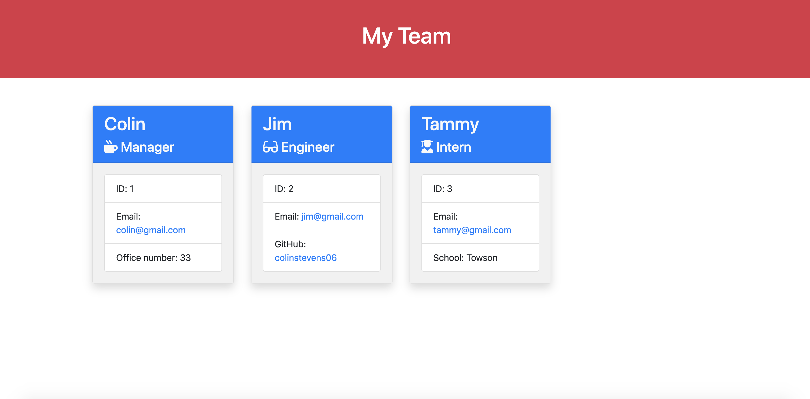

# 10-Employee-Summary-Template-Engine

## Object Oriented Programming

One of the main focuses of this project was reinforcing the new object oriented programming that we learned in classes throughout the week. I felt pretty good about that heading into the HW and got through that portion of the HW fairly quickly.

We had to write OOP to pass tests that were already built. I focused on that first.

We created a main class - employee - that was used in other classes, extending the employee class.

## Program's Logic

After creating my object classes, I used the Inquirer NPM package to setup the interface between my program and my user.

I wanted the line of questioning to go:

-  Gather information about the manager
-  Gather information about at least one other employee
-  Ask the manager if they'd like to add information about another employee
-  If yes, be prompted with same questions about the employee
-  If no, generate an HTML page

## Learning Achieved

This project certainly reinforced our basics of Node.JS - writing files, using backticks and \${} to reference data, and using packages to achieve goals.

The hardest part for me was figuring out how to combine all the cards for the individual employees and embed them into a master HTML file. I did this with some pretty simple lines of code, so I was happy with myself for figuring that out after brainstorming with my instructor and TA for a little bit via Slack.

## Screenshot

